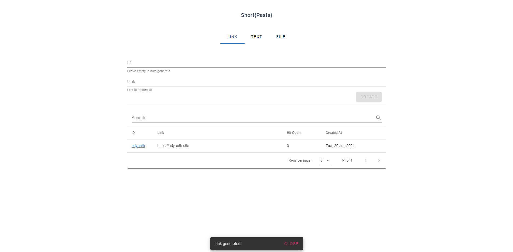
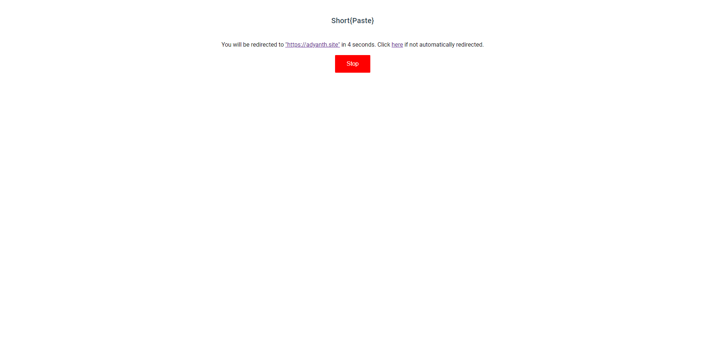
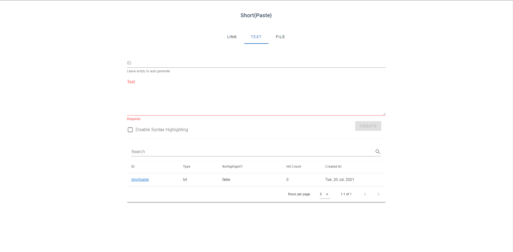
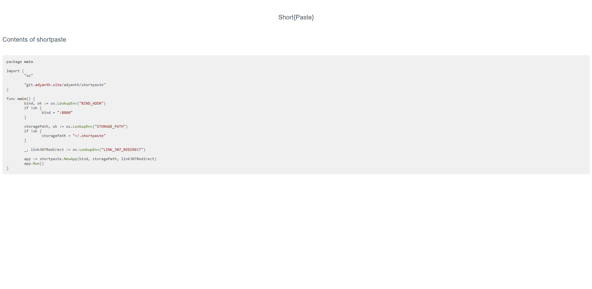
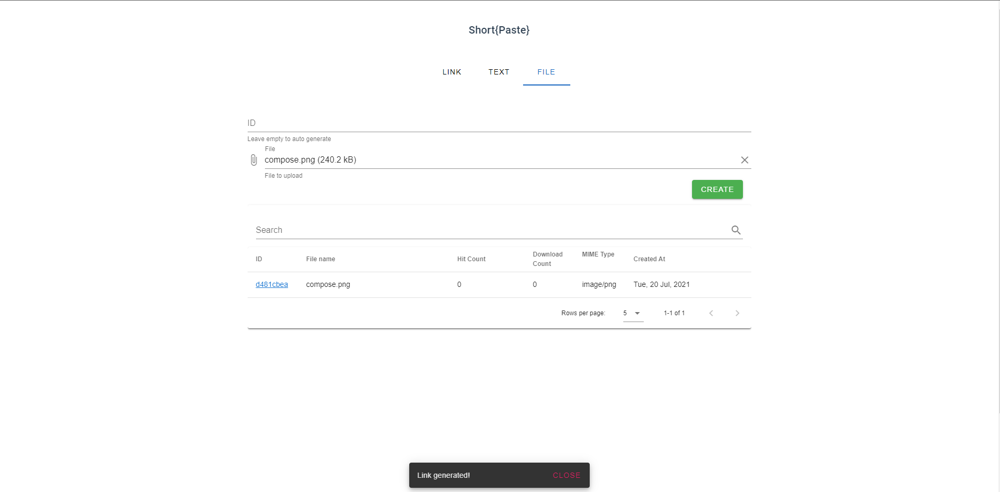
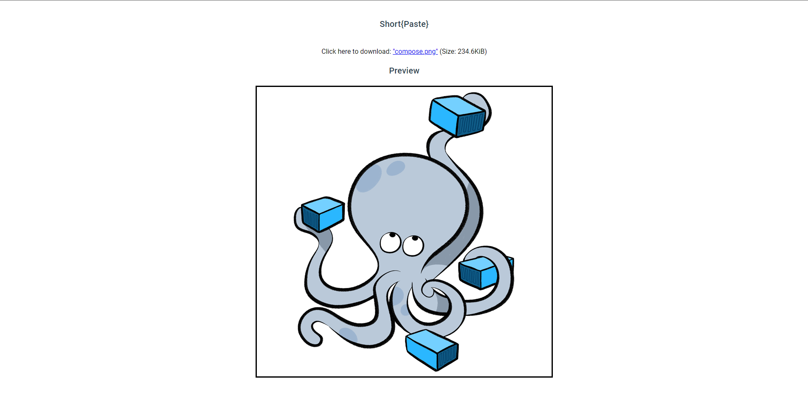

# Short{Paste}

[](https://drone.adyanth.site/adyanth/shortpaste)
[](https://hub.docker.com/r/adyanth/shortpaste)
[](https://goreportcard.com/report/git.adyanth.site/adyanth/shortpaste)

`Short{Paste}` is open-source software written in Go and VueJS. It is a minimalistic shortener that combines three things that need shortening: links, files, and text. It is a self-hosted alternative to many popular services like paste bin and using dropbox to send a file to someone quickly.

The Go backend handles saving files, links and text in DB and filesystem as needed, while the Vue UI provides a pretty view for you to add and review content. Added bonus, it tracks hit counts too!

## Deployment

The whole backend packages to a single binary and the app is bundled as a docker container based on `alpine`, favoured for its tiny size. To run this yourself, execute the command below.

```bash
docker run -d \
    -p 8080:8080 \
    -v ${PWD}/shortpaste/:/root/.shortpaste \
    adyanth/shortpaste:latest
```

This will publish the application on port `8080`, making it available on `http://localhost:8080/` and use the bind mounted folder called `shortpaste` in your current working directory to save the SQLite DB, the files and texts published.

## Build it yourself

With docker, you can build this yourself. A `Dockerfile` is provided at the root of this repository.

It uses a multi-stage build consisting of three stages:

- Go Build  : Builds a statically linked Go binary which contains the backend API server and the static server.
- Vue Build : Builds the VueJS UI to generate a `dist` folder with resources.
- Container : Alpine container where the binary and `dist` is copied to be served.

## Environment Variables

You can customize the behaviour using enironment variables. Here is a list of configurable parameters.

| Environment Variable | Default Value     | Behaviour                                                                                                                 |
| -------------------- | ----------------- | ------------------------------------------------------------------------------------------------------------------------- |
| `SP_BIND_ADDR`       | `":8080"`         | Sets the bind address inside the container.                                                                               |
| `SP_STORAGE_PATH`    | `"~/.shortpaste"` | Sets the location for saving data inside the container                                                                    |
| `SP_307_REDIRECT`    |                   | If this variable is set to anything, a 307 redirect will be sent instead of showing the landing page for shortened links. |

## Screenshots

Here are some screenshots to get a taste of it :)

### Links

Create:

View:


### Text

Create:

View:


### Files

Create:

View:

